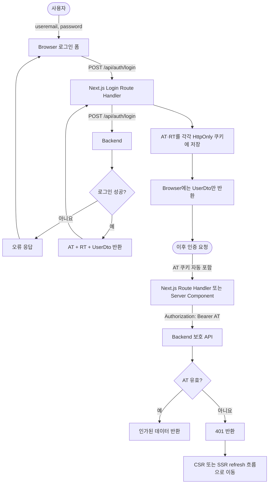
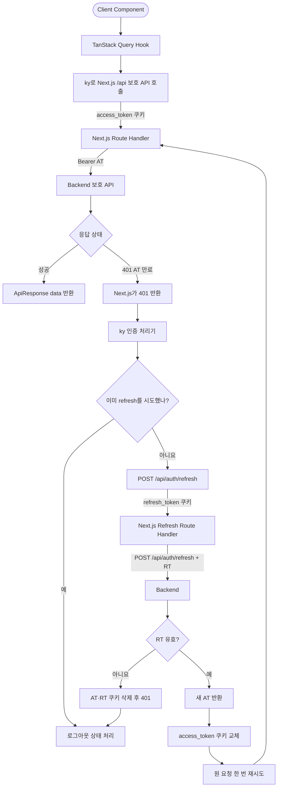

# 인증 아키텍처 확정안

상태: 확정. 이후 인증 설계와 구현은 이 문서를 기준으로 한다.

## 1. 한 줄 정의

백엔드가 발급한 AT·RT를 Next.js가 각각 HttpOnly 쿠키에 저장하고, SSR과 CSR 요청을 백엔드로 중계하는 Stateless Token BFF 구조를 사용한다.

## 2. 핵심 흐름도

### 로그인 및 공통 인증



### CSR refresh



### SSR refresh

```mermaid
flowchart TD
    A([Browser 페이지 요청]) -->|access_token 쿠키| B[Next.js Server Component]
    B --> C[server-only DAL]
    C -->|Bearer AT| D[Backend 보호 API]
    D --> E{응답 상태}
    E -->|성공| F[데이터로 SSR HTML 생성]
    F --> G([Browser에 HTML 응답])
    E -->|401 AT 만료| H[/api/auth/refresh로 redirect]
    H -->|refresh_token 쿠키 + 검증된 returnTo| I[Next.js Refresh Route Handler]
    I -->|POST /api/auth/refresh + RT| J[Backend]
    J --> K{RT 유효?}
    K -->|아니요| L[AT·RT 쿠키 삭제]
    L --> M([로그인 페이지 redirect])
    K -->|예| N[새 AT 반환]
    N --> O[access_token 쿠키 설정]
    O --> P[원래 페이지로 redirect]
    P --> A
```

## 3. 확정 사항

- 백엔드가 사용자, 권한, AT·RT의 최종 관리 주체다.
- Next.js에 Redis, DB 또는 Token Vault를 두지 않는다.
- 별도 `session_id`와 별도 `session` 쿠키를 만들지 않는다.
- AT와 RT를 각각 HttpOnly 쿠키에 저장한다.
- RT rotation은 사용하지 않는다.
- AT 만료 시간은 15분, RT 만료 시간은 7일이다.
- 로그인 ID는 `useremail`이다.
- 사용자 DTO는 `id`, `username`, `useremail`, `roles`를 사용한다.
- API 응답은 `ApiResponse<T>` Generic으로 통일한다.

```ts
type ApiResponse<T> = {
  code: string;
  message: string;
  data: T;
};
```

## 4. 저장 위치

| 위치 | 저장 내용 |
| --- | --- |
| 브라우저 HttpOnly 쿠키 | AT, RT |
| Next.js 메모리/DB/Redis | 저장하지 않음 |
| 백엔드 | 사용자, 권한, RT 폐기 상태, 토큰 정책 |
| TanStack Query | 브라우저에 공개 가능한 사용자 DTO |
| Zustand/localStorage | 인증 정보 저장 금지 |

권장 쿠키 범위:

| 쿠키 | 옵션 |
| --- | --- |
| `access_token` | `HttpOnly`, 운영 `Secure`, `SameSite=Lax`, `Path=/` |
| `refresh_token` | `HttpOnly`, 운영 `Secure`, `SameSite=Lax`, `Path=/api/auth` |

Client Component는 쿠키나 토큰을 직접 읽지 않는다.

## 5. 전체 구조

```text
Browser
  -> Next.js Route Handler / Server Component
    -> Backend API

Browser cookie: access_token + refresh_token
Backend request: Authorization: Bearer <AT> 또는 refresh body의 RT
```

## 6. 로그인

```text
Browser
  -> POST /api/auth/login { useremail, password }
Next.js Route Handler
  -> POST Backend /api/auth/login
Backend
  -> AT + RT + UserDto
Next.js Route Handler
  -> AT·RT를 HttpOnly 쿠키에 설정
  -> 토큰을 제외한 UserDto만 Browser에 반환
```

브라우저 응답에 AT·RT를 JSON으로 반환하지 않는다.

## 7. CSR 보호 API 요청

```text
TanStack Query -> ky -> Next.js /api/**
Next.js가 access_token 쿠키를 읽음
Next.js -> Backend: Authorization: Bearer <AT>
Backend -> Next.js -> Browser
```

클라이언트 인증 상태는 `GET /api/users/me` 결과를 TanStack Query로 관리한다.

## 8. CSR 토큰 갱신

```text
1. 보호 API가 AT 만료로 401 반환
2. ky의 인증 처리기가 POST /api/auth/refresh를 한 번 호출
3. Next.js Route Handler가 refresh_token 쿠키를 읽음
4. Next.js -> Backend POST /api/auth/refresh { refreshToken }
5. Backend -> 새 AT
6. Next.js가 access_token 쿠키만 교체
7. ky가 원 요청을 한 번 재시도
```

- 브라우저 단위 single-flight로 동시에 여러 refresh 요청을 만들지 않는다.
- refresh와 원 요청 재시도는 각각 최대 한 번만 허용한다.
- refresh 실패 시 AT·RT 쿠키를 모두 삭제하고 최종 `401`을 처리한다.

## 9. SSR 보호 페이지 요청

```text
1. Server Component/DAL이 access_token 쿠키를 읽음
2. AT로 백엔드 데이터를 요청
3. AT가 유효하면 SSR HTML 생성
4. AT 만료면 /api/auth/refresh?returnTo=<현재 경로>로 리다이렉트
5. Refresh Route Handler가 RT로 새 AT 발급
6. access_token 쿠키 설정 후 검증된 내부 returnTo로 복귀
```

Server Component 렌더링 중에는 쿠키를 변경하지 않는다. 쿠키 변경은 Route Handler에서만 한다. `returnTo`는 같은 사이트의 상대 경로만 허용해 open redirect를 막는다.

## 10. 로그아웃

```text
Browser -> POST /api/auth/logout
Next.js -> Backend POST /api/auth/logout { refreshToken }
Backend -> RT 폐기
Next.js -> AT·RT 쿠키 삭제
```

백엔드 로그아웃 응답이 실패하더라도 Next.js 쿠키는 삭제한다.

## 11. 인증과 권한

- 공개 페이지는 `/login`, `/register`뿐이다.
- `/login`, `/register`를 제외한 모든 페이지는 로그인 후에만 접근할 수 있다.
- 로그인한 사용자가 `/login` 또는 `/register`에 접근하면 기본 인증 페이지로 이동시킨다.
- Proxy는 AT 쿠키 존재 여부를 이용한 낙관적 리다이렉트만 담당한다. 보호 경로에 AT가 없으면 로그인 페이지가 아니라 refresh Route Handler로 보내고, RT까지 없거나 유효하지 않을 때 로그인 페이지로 보낸다.
- Proxy 또는 UI의 판단을 실제 권한 검사로 사용하지 않는다.
- Next.js의 `server-only` DAL은 백엔드 호출과 SSR 리다이렉트를 통일한다.
- 실제 사용자 상태와 역할 권한은 백엔드가 AT와 최신 사용자 데이터를 기준으로 검사한다.
- `401`은 인증 실패·토큰 만료, `403`은 인증됐지만 권한 부족을 의미한다.

## 12. 보안 기준

- 상태 변경 Route Handler는 Origin을 검증한다.
- 인증 응답과 사용자별 응답은 `Cache-Control: private, no-store`를 사용한다.
- AT·RT를 로그, URL, 클라이언트 상태, 응답 JSON에 노출하지 않는다.
- RT rotation을 사용하지 않으므로 백엔드는 RT를 저장·검증·폐기할 수 있어야 한다.
- RT가 탈취되면 만료 또는 폐기 전까지 재사용될 수 있음을 수용한다.

## 13. 관련 문서

- [프론트엔드-백엔드 인증 API 계약](./auth-api-contract.md)
- [API 문서 설계 순서](./api-design-order.md)
